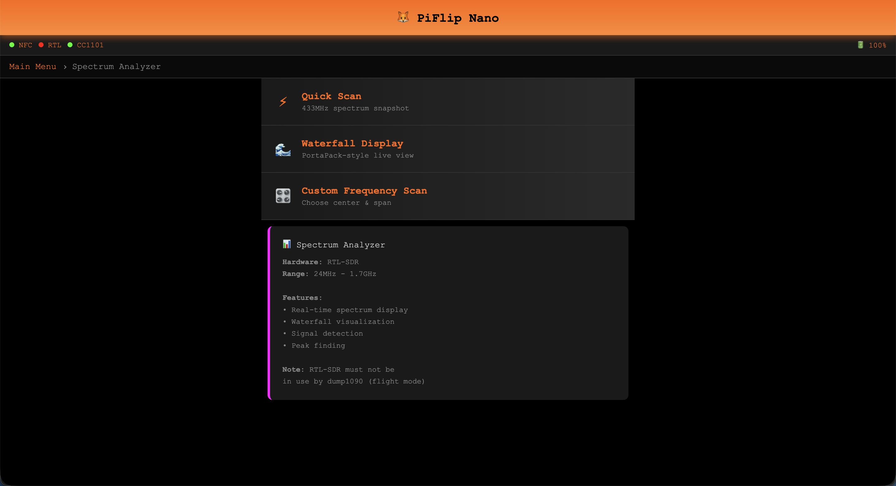

# 🦊 PiFlip

**A Powerful RF Security Research Tool Built on Raspberry Pi**

PiFlip is a Flipper Zero alternative with more power, wider frequency range, and a professional web interface. Perfect for security research, RF analysis, and NFC testing.


---

## ✨ Key Features

### 📡 **RF Power Tools**
Advanced transmission features for security testing:
- **Signal Fuzzing** - Find hidden commands by mutating captured signals
- **Protocol Encoder** - Create signals from scratch (PT2262, PT2264, HCS301)
- **Frequency Scanner** - Auto-sweep to find unknown frequencies
- **Signal Playlists** - Automate complex transmission sequences
- **Jamming Tool** - Test RF security (educational use only)


### 🛡️ **NFC Security Suite**
Professional NFC security and testing tools:
- **NFC Guardian** - Real-time monitoring with suspicious pattern detection
- **Card Catalog** - Complete inventory system for all your NFC cards
- **RFID Wallet Tester** - Test blocking effectiveness of RFID-blocking wallets
- **NFC Emulation** - Emulate saved cards (experimental)
- **Deep Analysis** - Comprehensive card analysis and security assessment

<table>
  <tr>
    <td width="50%"></td>
    <td width="50%"></td>
  </tr>
  <tr>
    <td align="center"><sub>NFC Guardian Active Monitoring</sub></td>
    <td align="center"><sub>NFC Deep Analysis Results</sub></td>
  </tr>
</table>

### 📶 **Wireless Tools**
Comprehensive wireless scanning and management:
- **Bluetooth Scanner** - BLE and Classic device discovery
- **WiFi Hotspot** - Turn PiFlip into mobile access point
- **WiFi Scanner** - Network discovery and analysis
- **Spectrum Analyzer** - PortaPack-style waterfall display


### 🔧 **Sub-GHz RF Tools**
Complete RF capture, analysis, and replay:
- **433MHz Scanner** - Detect remotes, sensors, and IoT devices
- **TPMS Scanner** - Read tire pressure sensors
- **Weather Station** - Decode weather sensor data
- **Signal Capture** - Record and save RF signals (RTL-SDR & CC1101)
- **Signal Replay** - Transmit saved signals with CC1101


---

## 🔥 Why PiFlip?

**Advantages over Flipper Zero:**
- ✅ More powerful hardware (Raspberry Pi 3B vs STM32)
- ✅ Wideband SDR (24 MHz - 1.7 GHz vs 433 MHz only)
- ✅ Web interface (use from phone, tablet, laptop)
- ✅ Better NFC features (Guardian, Catalog, Wallet Tester)
- ✅ Advanced RF tools (Fuzzing, Protocol Encoder, Freq Scanner)
- ✅ 95+ API endpoints for automation
- ✅ Open source and extensible
- ✅ Lower cost (~$120 vs $169)

**Advantages over HackRF:**
- ✅ Easier to use (no GNU Radio knowledge required)
- ✅ Built-in protocol support
- ✅ Web interface for remote access
- ✅ NFC capabilities (HackRF can't do NFC)
- ✅ Turnkey solution (flash and go)

---

## 🛠️ Hardware Requirements

### Required Components
| Component | Purpose | Cost |
|-----------|---------|------|
| **Raspberry Pi 3B/3B+** | Main computer | $35 |
| **RTL-SDR Blog V4** | Wideband receiver (24 MHz - 1.7 GHz) | $40 |
| **CC1101 Module** | Sub-GHz transceiver (300-928 MHz TX/RX) | $5 |
| **PN532 NFC Module** | NFC/RFID reader/writer (13.56 MHz) | $10 |
| **32GB MicroSD Card** | Storage | $10 |
| **5V 3A Power Supply** | Power (**critical!**) | $10 |
| **Total** | | **~$120** |

### Pin Connections

**PN532 (I2C):**
```
PN532 → Raspberry Pi
VCC   → Pin 1  (3.3V)
GND   → Pin 6  (GND)
SDA   → Pin 3  (GPIO 2)
SCL   → Pin 5  (GPIO 3)
```

**CC1101 (SPI):**
```
CC1101 → Raspberry Pi
VCC    → Pin 17 (3.3V)
GND    → Pin 9  (GND)
SCK    → Pin 23 (GPIO 11)
MISO   → Pin 21 (GPIO 9)
MOSI   → Pin 19 (GPIO 10)
CSN    → Pin 24 (GPIO 8)
GDO0   → Pin 11 (GPIO 17)
GDO2   → Pin 31 (GPIO 6)
```

**RTL-SDR:** USB connection only

---

## 🚀 Quick Start

### Option 1: Flash Pre-built Image (Coming Soon)
1. Download PiFlip image
2. Flash to 32GB microSD card using [Raspberry Pi Imager](https://www.raspberrypi.com/software/)
3. Connect hardware modules
4. Power on Raspberry Pi
5. Access web interface at `http://piflip.local:5000`

### Option 2: Manual Installation
See [Installation Guide](docs/guides/getting-started.md)

### First Time Setup
1. Connect to PiFlip network or find IP on your network
2. Open browser and navigate to `http://piflip.local:5000`
3. Check hardware status in Dashboard
4. Start exploring features!

---

## 📸 Screenshots Gallery

### 🏠 Main Interface
<div align="center">

| Main Menu | RF Signal Library | Advanced TX |
|:---------:|:-----------------:|:-----------:|
|  |  |  |
| *All features accessible from main menu* | *Manage captured signals* | *Advanced transmission tools* |

</div>

### 📡 RF Tools & Signal Analysis
<div align="center">

| Live Capture | Saved Captures | Signal Strength |
|:------------:|:--------------:|:---------------:|
|  |  |  |
| *Real-time signal capture* | *View and replay saved signals* | *Monitor signal strength* |

| Frequency Scanner | Quick Test | Saved Captures List |
|:-----------------:|:----------:|:-------------------:|
|  |  |  |
| *Auto-sweep frequency ranges* | *Quick signal testing* | *All your captures* |

</div>

### 🛡️ NFC Security Suite
<div align="center">

| NFC Tools Menu | Card Scan | Card Library |
|:--------------:|:---------:|:------------:|
|  |  |  |
| *Complete NFC toolkit* | *Scan and analyze cards* | *Your saved cards* |

| NFC Guardian | Continuous Scan | Deep Analysis |
|:------------:|:---------------:|:-------------:|
|  |  |  |
| *Real-time threat monitoring* | *Monitor NFC activity* | *Detailed card analysis* |

| Guardian Status | Suspicious Events | Deep Analysis Results |
|:---------------:|:-----------------:|:---------------------:|
|  |  |  |
| *View monitoring status* | *Security threat log* | *Security assessment* |

| Card Catalog | Wallet Tester | Test Results |
|:------------:|:-------------:|:------------:|
|  |  |  |
| *Inventory all your cards* | *Test RFID blocking* | *Effectiveness results* |

</div>

### 📶 Wireless Tools
<div align="center">

| Bluetooth Scanner | BT Scan Results | WiFi Tools |
|:-----------------:|:---------------:|:----------:|
|  |  |  |
| *BLE & Classic scanning* | *Discovered devices* | *WiFi management* |

| WiFi Networks | Spectrum Analyzer | Settings |
|:-------------:|:-----------------:|:--------:|
|  |  |  |
| *Network scanner* | *Real-time spectrum view* | *System configuration* |

</div>

<div align="center">

**📁 [View all 32 screenshots →](docs/screenshots/)**

</div>

---

## 📚 Documentation

### Getting Started
- [Getting Started Guide](docs/guides/getting-started.md) - Basic usage and setup
- [RTL-SDR Setup](docs/setup/rtl-sdr-setup.md) - RTL-SDR specific configuration
- [Troubleshooting](docs/guides/troubleshooting.md) - Common issues and solutions

### Features
- [NFC Security Suite](docs/features/nfc-security-suite.md) - Guardian, Catalog, Wallet Tester
- [Wireless Tools](docs/features/wireless-tools.md) - Bluetooth, WiFi, Spectrum Analyzer
- [Signal Types Explained](docs/guides/signal-types.md) - Understanding different RF signals

### Advanced
- [API Reference](docs/guides/api-reference.md) - All 95+ REST endpoints
- [Advanced TX Guide](docs/guides/advanced-tx.md) - Signal fuzzing, encoding, scanning
- [TX Verification Guide](docs/guides/tx-verification.md) - Testing transmission features

### Development
- [Roadmap](docs/development/roadmap.md) - Future features and plans
- [Flipper Zero Comparison](docs/development/flipper-comparison.md) - Feature comparison
- [AI Integration](docs/development/ai-integration.md) - Using Claude with PiFlip

---

## 🎯 Use Cases

### Security Research
- Test RFID/NFC security of your own devices
- Analyze RF protocols and find vulnerabilities
- Test jamming resistance of wireless systems
- Evaluate RFID-blocking wallet effectiveness

### RF Analysis
- Capture and decode 433MHz devices (remotes, sensors)
- Analyze tire pressure monitoring systems (TPMS)
- Decode weather station transmissions
- Reverse engineer RF protocols

### Penetration Testing
- Assess wireless security for authorized clients
- Test badge cloning vulnerabilities
- Evaluate RF attack surface
- Document NFC security posture

### Education & Learning
- Learn about RF protocols and modulation
- Understand NFC/RFID technology
- Practice signal analysis
- Experiment with SDR technology

---

## ⚠️ Legal & Ethical Use

**IMPORTANT:** PiFlip is designed for:
- ✅ Security research on YOUR OWN devices
- ✅ Educational purposes and learning
- ✅ Authorized penetration testing with permission
- ✅ RF protocol analysis and research

**ILLEGAL uses:**
- ❌ Interfering with others' wireless systems
- ❌ Jamming communications (illegal in most countries)
- ❌ Cloning cards you don't own
- ❌ Unauthorized access to systems
- ❌ Car theft or car hacking
- ❌ Stealing RFID/NFC credentials

**You are responsible for complying with all local laws and regulations.**

---

## 🛠️ Technical Specifications

| Specification | Details |
|---------------|---------|
| **Frequency Range** | 24 MHz - 1.7 GHz (receive)<br/>300-928 MHz (transmit) |
| **NFC/RFID** | 13.56 MHz (ISO14443A/B, MIFARE) |
| **Sub-GHz** | 300-348 MHz, 387-464 MHz, 779-928 MHz |
| **Modulation** | OOK, ASK, FSK, GFSK, MSK |
| **Sample Rate** | Up to 2.4 MS/s (RTL-SDR) |
| **TX Power** | Up to +10 dBm (CC1101) |
| **Interface** | Web UI (responsive, mobile-friendly) |
| **API** | 95+ REST endpoints |
| **Languages** | Python 3, JavaScript |
| **Platform** | Raspberry Pi 3B/3B+/4 |

---

## 🚀 Recent Updates

### v2.0 - October 2025
**Major Release: NFC Security Suite & RF Power Tools**

**New Features:**
- 🛡️ **NFC Guardian** - Real-time security monitoring with pattern detection
- 📇 **Card Catalog** - Complete NFC card inventory system
- 🧪 **RFID Wallet Tester** - Test blocking effectiveness
- 🎲 **Signal Fuzzing** - Automated signal mutation for security testing
- 🔤 **Protocol Encoder** - Create signals from scratch (PT2262, PT2264, HCS301)
- 📡 **Frequency Scanner** - Auto-sweep frequency ranges
- 📋 **Signal Playlists** - Automate transmission sequences
- ⚡ **Jamming Tool** - RF interference for security testing
- 🔴 **Shutdown/Reboot** - Power management from web UI

**Improvements:**
- Fixed Deep Analysis block rendering bug
- Updated UI with 32 comprehensive screenshots
- Reorganized documentation structure
- 15 new API endpoints
- Enhanced error handling

See [ROADMAP.md](docs/development/roadmap.md) for planned features.

---

## 🙏 Credits

**Built with:**
- [RTL-SDR](https://www.rtl-sdr.com/) - Software Defined Radio
- [CC1101](https://www.ti.com/product/CC1101) - Texas Instruments Sub-GHz transceiver
- [PN532](https://www.nxp.com/docs/en/nxp/data-sheets/PN532_C1.pdf) - NXP NFC controller
- [Flask](https://flask.palletsprojects.com/) - Web framework
- [Adafruit Libraries](https://github.com/adafruit) - Python drivers
- Inspired by [Flipper Zero](https://flipperzero.one/)

**Special thanks:**
- Open source SDR community
- Raspberry Pi Foundation
- Security research community
- All contributors and testers

---

## 📜 License

**Educational and Security Research Use Only**

This project is provided for educational purposes and authorized security research only. The authors are not responsible for misuse or illegal activities performed with this tool.

See [LICENSE](LICENSE) for details.

---

## 📞 Support & Community

- **Documentation:** [docs/](docs/) - Comprehensive guides and references
- **Issues:** [GitHub Issues](https://github.com/RedThoroughbred/piflip/issues) - Report bugs
- **Discussions:** [GitHub Discussions](https://github.com/RedThoroughbred/piflip/discussions) - Ask questions

---

## 🌟 Star History

If you find PiFlip useful, please star the repo! ⭐

It helps others discover the project and motivates continued development.

---

**Made with ❤️ by the security research community**

**PiFlip v2.0** - October 2025


